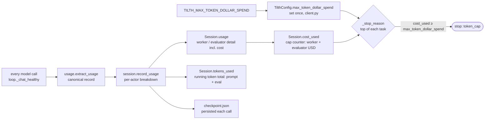

# Token recording and dollar-spend enforcement

Tilth records the provider's own `usage` block in **full** — prompt, completion, cached, and reasoning tokens plus the USD cost — and enforces a cumulative session **dollar** cap **between tasks**. The guiding principle: carry the full detail through every layer; aggregate lossily only at the edges (the cap check and human-facing display). The whole path is short; this page is the map, with pointers into the code.



## One canonical usage record

`tilth/usage.py` is the single source of truth for what a model call cost and how such records combine. `extract_usage` reads a provider `usage` block into one dict — `{prompt, eval, total, cached, reasoning, cost}` — and `add_usage` is the one field-wise combine primitive, reused by the live session and every summary aggregation so the breakdown can never drift between them. The load-bearing invariant: **`cached ⊆ prompt` and `reasoning ⊆ eval`** — they are subsets (cache hits among the prompt tokens; thinking tokens among the completion tokens), never additive, and must never inflate the token total.

## The cap is set once

`tilth/client.py` reads `TILTH_MAX_TOKEN_DOLLAR_SPEND` (default `10.00`) into `TilthConfig.max_token_dollar_spend` — one float of USD per run, never mutated.

## The session owns the running counters

`record_usage(u, phase)` (`tilth/session.py`) routes the full record into the actor's `Session.usage` bucket (`worker` / `evaluator`), advances `Session.tokens_used` by `prompt + eval` (cached/reasoning excluded — they are subsets), and **immediately persists `checkpoint.json`**, so if the process dies the next `tilth resume` continues from the saved breakdown — accounting survives crashes. Two counters fall out of that one breakdown:

- **`Session.cost_used()`** — the dollar-spend cap counter: the provider's own `cost` summed across the worker and evaluator buckets.
- **`Session.tokens_used`** — the running token total, kept for display (the CLI summary and visualizer chips) and for the `tokens_used_total` field on each `model_call` event.

Both homes — in-memory and a JSON file at most one call out of date. (Old checkpoints predate the `usage` breakdown; `wake()` defaults it to zero while still restoring `tokens_used` — the full per-call history remains in `events.jsonl`.)

## One call site records usage

Every model call — worker and evaluator alike — routes through the single provider-health gate `loop._chat_healthy`. It calls `client.chat`, reads the `usage` block into the canonical record, and records it **per attempt** (before logging the event, so `tokens_used_total` is post-increment):

```python
u = usage.extract_usage(resp.get("usage"))
session.record_usage(u, base.get("phase"))   # phase None → worker bucket
```

Deliberate choices:

- **Source of truth = the provider.** No local tokenisation (no `tiktoken`); we trust the `usage` block every OpenAI-compatible endpoint returns. On OpenRouter we send the `usage: {include: true}` opt-in (gated like the reasoning opt-in) so the detail and `cost` are always populated.
- **Tolerant extraction.** `extract_usage` coerces missing/`null`/absent fields to zero rather than crashing a two-hour run on one weird leaf; non-OpenRouter providers simply degrade to prompt/eval/total with the rest zeroed.
- **The cap reads `cost`, the provider's own USD figure.** We trust the provider's accounting rather than multiplying tokens by a price table we'd have to keep in step with every model. The token total stays `prompt + eval` (the two fields we trust, equivalent to `total_tokens`); cached/reasoning never inflate it.

`_chat_healthy` logs a `model_call` event on every attempt (healthy or not), carrying the full flat detail (`prompt_tokens`, `eval_tokens`, `cached_tokens`, `reasoning_tokens`, `cost`, `tokens_used_total`), the health verdict, and provider evidence — so grepping `events.jsonl` for `model_call` reconstructs exactly when money was spent, on what, and why each turn ended. `summary.py` re-aggregates those events into per-session, per-actor, and per-task breakdowns (`summary.json`); the CLI run summary and the visualizer read those. Because recording happens on every attempt, a provider-retry's spend is counted even though the unhealthy response never became a conversation turn.  See [Session layout → Event types](session-layout.md#event-types) and [Hyper-observability](hyper-observability.md).

## Enforcement is at the top of each task

`_stop_reason()` (`tilth/loop.py`) checks both session-level caps before the outer loop picks the next task:

```python
def _stop_reason(client, session):
    if session.elapsed_minutes() >= client.config.max_wall_clock_minutes:
        return "wall_clock"
    if session.cost_used() >= client.config.max_token_dollar_spend:
        return "token_cap"
    return None
```

So enforcement granularity is **between tasks, not between calls**. A task already running finishes (or hits its iteration cap) even if it tips over the budget mid-task; the cap stops the *next* task from starting. (The stop reason is still named `token_cap` in the event log and session-status vocabulary — the label is kept stable across old and new logs even though the dimension it now measures is dollars.)

- **Pro:** never abandon a task half-finished — the branch always has clean per-task commits.
- **Con:** a runaway task can overshoot by up to `MAX_ITERATIONS_PER_TASK × cost_per_call`.

Hard mid-task enforcement would be the same check inside `_run_task`'s loop with an early break — five lines, but you'd lose the "always finish the current task cleanly" property. That trade-off is [invariant 6](../architecture/overview.md#architecture-invariants-worth-preserving).

## Cumulative spend, per-resume wall-clock

`checkpoint.json` carries the `usage` breakdown (and thus the cumulative `cost`), and `tilth resume` reads it back — so **resuming a spend-capped session re-trips the cap immediately** unless you bump `TILTH_MAX_TOKEN_DOLLAR_SPEND` in `.env` first (env is read on each invocation). Wall-clock is the opposite: `Session.wake()` resets `started_at` to "now" each resume, so that cap is per-resume. **Spend is cumulative; wall-clock is per-resume** — asymmetric on purpose.

## What it tracks, and what it still won't cap

The accounting carries the full detail end to end:

- **Dollar cost is both the cap and a recorded metric** — OpenRouter's own `cost` per call, aggregated per session / per actor / per task, shown in the CLI summary and visualizer, *and* summed by `cost_used()` into the spend cap. Token counts are still recorded and displayed alongside, but no longer cap anything.
- **Worker vs evaluator is split**, not mashed together — `Session.usage` and the summary's `by_phase` keep the allocation, and the cached/reasoning subsets are carried alongside.

What it deliberately still does *not* do:

1. **No spend cap where the provider reports no cost.** The cap reads the provider's `cost` field; a gateway that omits it leaves `cost_used()` at `$0`, so the dollar cap never trips and **wall-clock is the only backstop**. (OpenRouter reports cost; other OpenAI-compatible gateways are untested here.) If you run such a provider, lean on `TILTH_MAX_WALL_CLOCK_MINUTES` and `MAX_ITERATIONS_PER_TASK`.
2. **No headroom *stop*.** The cap is binary — no "you're at 80%" halt (the visualizer's utilization meters are the at-a-glance version).
3. **The spend cap is whole-session, not per-task.** Tasks 1–9 could starve task 10. The iteration cap (32 calls/task) is the per-task proxy.
