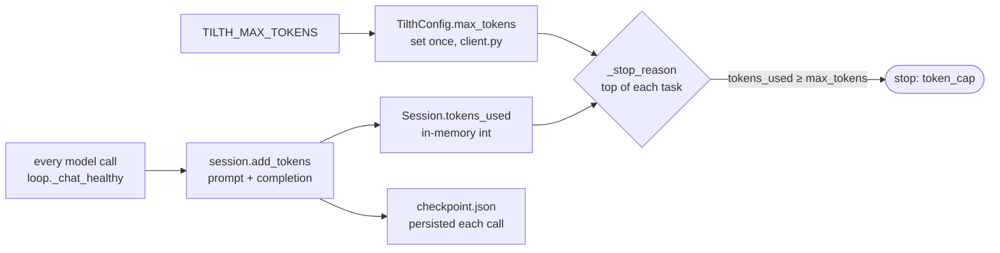

# Token recording and enforcement

Tilth records token spend from the provider's own `usage` block and enforces a cumulative session cap **between tasks**. The whole path is short; this page is the map, with pointers into the code.



## The cap is set once

`tilth/client.py` reads `TILTH_MAX_TOKENS` (default 2,000,000) into `TilthConfig.max_tokens` — one integer per run, never mutated.

## The session owns the running counter

`Session.tokens_used` (`tilth/session.py`) is the live total. `add_tokens(n)` increments it and **immediately persists `checkpoint.json`**, so if the process dies the next `tilth resume` continues from the saved total — token accounting survives crashes. The counter has two homes: an in-memory `int` and a JSON file at most one call out of date.

## One call site records tokens

Every model call — worker and evaluator alike — routes through the single provider-health gate `loop._chat_healthy`. It calls `client.chat`, reads the `usage` block, and records tokens **per attempt** (before logging the event, so `tokens_used_total` is post-increment):

```python
usage = resp.get("usage") or {}
prompt_tokens = int(usage.get("prompt_tokens") or 0)
eval_tokens   = int(usage.get("completion_tokens") or 0)
session.add_tokens(prompt_tokens + eval_tokens)
```

Three deliberate choices in those four lines:

- **Source of truth = the provider.** No local tokenisation (no `tiktoken`); we trust the `usage` block every OpenAI-compatible endpoint returns.
- **`or 0` everywhere.** A malformed response counts as zero rather than crashing a two-hour run on one weird `null`.
- **`prompt + completion`, not `total`.** We sum the two fields we trust; equivalent to `total_tokens` for any well-formed response.

`_chat_healthy` logs a `model_call` event on every attempt (healthy or not), carrying the two token counts, `tokens_used_total`, the health verdict, and provider evidence — so grepping `events.jsonl` for `model_call` reconstructs exactly when tokens were spent and why each turn ended. Because recording happens on every attempt, a provider-retry's tokens are counted even though the unhealthy response never became a conversation turn. See [Session layout → Event types](session-layout.md#event-types) and [Hyper-observability](hyper-observability.md).

## Enforcement is at the top of each task

`_stop_reason()` (`tilth/loop.py`) checks both session-level caps before the outer loop picks the next task:

```python
def _stop_reason(client, session):
    if session.elapsed_minutes() >= client.config.max_wall_clock_minutes:
        return "wall_clock"
    if session.tokens_used >= client.config.max_tokens:
        return "token_cap"
    return None
```

So enforcement granularity is **between tasks, not between calls**. A task already running finishes (or hits its iteration cap) even if it tips over the budget mid-task; the cap stops the *next* task from starting.

- **Pro:** never abandon a task half-finished — the branch always has clean per-task commits.
- **Con:** a runaway task can overshoot by up to `MAX_ITERATIONS_PER_TASK × tokens_per_call`.

Hard mid-task enforcement would be the same check inside `_run_task`'s loop with an early break — five lines, but you'd lose the "always finish the current task cleanly" property. That trade-off is [invariant 6](../architecture/overview.md#architecture-invariants-worth-preserving).

## Cumulative tokens, per-resume wall-clock

`checkpoint.json` carries the final `tokens_used`, and `tilth resume` reads it back — so **resuming a token-cap-stopped session re-trips the cap immediately** unless you bump `TILTH_MAX_TOKENS` in `.env` first (env is read on each invocation). Wall-clock is the opposite: `Session.wake()` resets `started_at` to "now" each resume, so that cap is per-resume. **Tokens are cumulative; wall-clock is per-resume** — asymmetric on purpose.

## What this does *not* do

1. **No dollar-cost tracking.** Tokens, not dollars — provider-agnostic, useless for "stop at $50." Would need a per-model price table at the `add_tokens` site.
2. **No per-model breakdown.** Worker and evaluator totals are mashed together. Splitting into `worker_tokens_used` / `evaluator_tokens_used` is ~10 lines if it matters.
3. **No headroom warning.** The cap is binary — no "you're at 80%" alert. Easy to add in `_stop_reason`.
4. **The cap is whole-session, not per-task.** Tasks 1–9 could starve task 10. The iteration cap (32 calls/task) is the per-task proxy.
