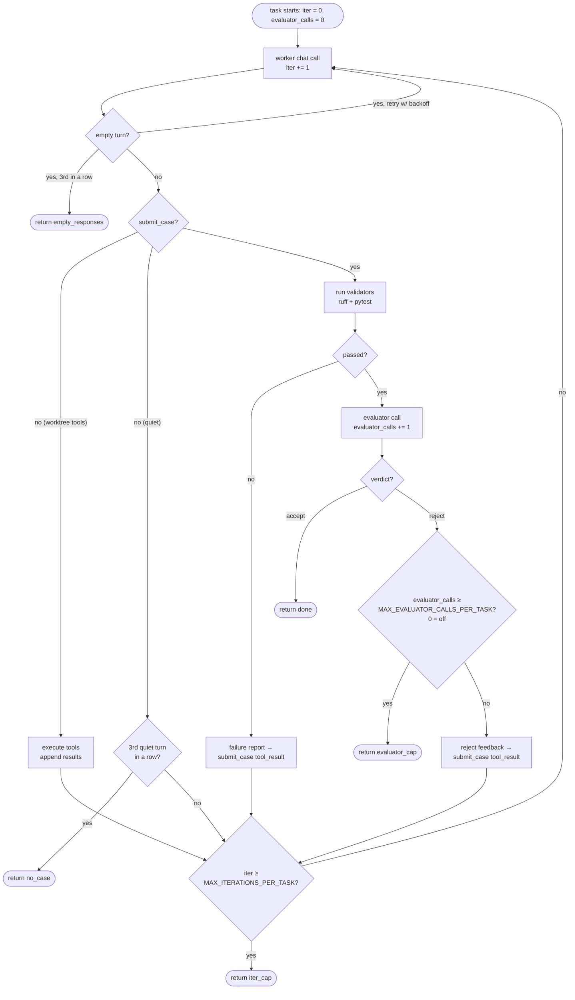

# The two loops (Ralph vs. tool-use)

There are two loops in the harness, and the names matter because they govern different things.

## Outer loop — `run()` in `loop.py`

The Ralph loop proper. Picks the next pending task from `prd.json`, runs it to completion, resets context, picks the next one.

Bounded by:

- `TILTH_MAX_WALL_CLOCK_MINUTES`
- `TILTH_MAX_TOKENS`
- "no more pending tasks"

This loop has no iteration cap. If you have 20 tasks and the wall-clock and token caps allow it, it'll run all 20.

## Inner loop — `_run_task()` in `loop.py`

The tool-use / ReAct loop *inside* a single task. Bounded by `TILTH_MAX_ITERATIONS_PER_TASK`. **This is what the env var caps.**

```python
for iter_n in range(client.config.max_iterations_per_task):
    resp = client.chat(messages, tools=tool_schemas)
    ...
```

So: "Ralph loop = outer, tool-use loop = inner, the iterations env var caps the inner."

> **Diagram suggestion** — *two nested boxes: an outer "Ralph loop" labelled with `MAX_WALL_CLOCK_MINUTES` and `MAX_TOKENS`, containing an inner "tool-use loop" labelled with `MAX_ITERATIONS_PER_TASK`. Arrows on the outer loop iterate over tasks; arrows on the inner iterate over model calls within one task. Annotate where each cap fires.*

## What one inner iteration actually is

Each iteration is **exactly one worker `client.chat()` call**, plus whatever the harness does in response. The branches per iteration:

1. **Model calls worktree tools** (`bash`, `read_file`, `edit_file`, …). Harness executes them (with `pre_tool` hook gating, `post_edit` follow-up), appends results as tool messages, `continue` to next iteration.
2. **Model calls `submit_case`** (its done-signal — see [The worker↔evaluator dialogue](worker-evaluator-dialogue.md)). The worker presents a structured case (summary + AC→`file:symbol` mapping + work-arounds + uncertainties). Harness runs validators (`ruff`, `pytest`). pytest is **filtered to the current task's tests plus every previously-completed task's tests**, by filename convention (`tests/test_<task-id-lower>_*.py`). Tests for still-`pending` tasks are excluded — so a future task's failing tests can't masquerade as the current task's failure and pull the worker into building out-of-scope code — but tests from `done` tasks stay in scope, so a regression there fails the current task and gets fed back to the worker.
    - Validators pass → evaluator call. Evaluator accepts → `return "done"`. Evaluator rejects → the structured reject is returned as the `submit_case` tool_result, fall through to next iteration.
    - Validators fail → the failure report is returned as the `submit_case` tool_result, fall through to next iteration.
3. **Model goes quiet without a case** — no tool calls and no `submit_case`. Not "done": the harness nudges it to submit one, and after `MAX_CONSECUTIVE_NO_CASE_NUDGES` (3) quiet turns in a row gives up → `return "no_case"`.
4. **Provider returns an empty turn** — no content, no tool calls, no reasoning (a provider hiccup, not the worker stopping). Retried with backoff; after `EMPTY_RESPONSE_RETRY_LIMIT` (3) in a row → `return "empty_responses"`.
5. **Loop falls off the end** — N iterations consumed, the worker still hasn't both submitted a case *and* satisfied validators + evaluator → `return "iter_cap"`. Task gets marked `failed` in `prd.json`, the run halts.

## What does and doesn't count as an iteration

| Action | Counts as an iteration? |
|---|---|
| Worker model call (any of the branches above) | **Yes** — one per iteration |
| Tool execution (bash, file ops, etc.) | No — runs as part of an iteration |
| Validator runs (ruff, pytest) | No |
| Evaluator model call | **No** — separate call, not an iteration |
| `_self_improve` proposed-learning call | **No** — happens once after the inner loop returns "done" |
| Validator failure feedback round | Yes — the next worker call to fix it is iteration N+1 |
| Evaluator rejection feedback round | Yes — same reason |

## A subtlety: evaluator rejections eat iterations

This is worth flagging because it's not obvious. Under `MAX_ITERATIONS_PER_TASK` (32 by default):

- Worker spends several iterations writing code, then submits a case.
- Validators pass, evaluator rejects.
- Worker now has to address the rejection, submit again, and get re-evaluated — all out of the *same* fixed budget.
- If the evaluator rejects again, the worker has fewer iterations left to recover; a string of rejections can run a task into the cap.

**A stricter evaluator effectively shrinks the working iteration budget.** The evaluator prompt's instruction that "vague rejections waste worker iterations" exists for this exact reason — every reject costs the worker forward progress on the same fixed budget.

The evaluator isn't amnesiac within a task: each call reads the last few entries of a per-task ledger (`sessions/<id>/ledger/<task_id>.jsonl`) — its own prior verdicts on this task — so it can confirm a concern was resolved instead of re-litigating, and escalate when the same rejection category recurs. The worker sees the same ledger (its reviewer's prior verdicts) on later iterations. See [The worker↔evaluator dialogue](worker-evaluator-dialogue.md) for the full mechanism.

There is also an *optional* second cap that bounds the same failure mode from the evaluator side: `MAX_EVALUATOR_CALLS_PER_TASK` . Set to `0` (the default), it does nothing. Set to N, the task is marked `failed` after the Nth evaluator rejection on this task — the run halts with reason `evaluator_cap`. The cap exists for the worker↔evaluator ping-pong case where the iteration budget would otherwise let the worker keep retrying right up until `iter_cap`, burning tokens on a task the evaluator is never going to accept. Pick a number you're willing to spend per stuck task; leave unset if you'd rather let `MAX_ITERATIONS_PER_TASK` and `MAX_TOKENS` be the only ceilings.

## Inner-loop flow



> **Diagram suggestion** — *the mermaid block above renders directly on GitHub and on mkdocs themes that ship Mermaid (e.g. mkdocs-material with `pymdownx.superfences`). With the vanilla `mkdocs` theme it falls back to a code block. If we ever publish a static SVG of this flowchart, swap it in here as the canonical version.*

The verdict is a structured `submit_verdict` tool call — `accept`/`reject` plus, on reject, a `rejection_category` (one of six), a concern, evidence pointers, and a concrete `next_step` that becomes the worker-visible reject feedback. See [The worker↔evaluator dialogue](worker-evaluator-dialogue.md).

Four halt-with-failure exits (`iter_cap`, `evaluator_cap`, `empty_responses`, `no_case`), one halt-with-success exit (`done`). All failure exits mark the task `failed`, log a `task_failed` event with the matching `reason`, and stop the Ralph loop — `tilth resume` flips them back to pending and unwinds the FAILED placeholder commit, so none is destructive.

## Worst-case tokens per task

```
worker_tokens × MAX_ITERATIONS_PER_TASK       (32 by default)
+ evaluator_tokens × number_of_evaluator_calls (1 per submit_case that passes
                                                validators; capped by
                                                MAX_EVALUATOR_CALLS_PER_TASK if set,
                                                otherwise unbounded within the
                                                iteration budget)
+ self_improve_tokens                          (1 if task succeeds, 0 otherwise)
```

The evaluator is called once per `submit_case` attempt that passes validators. With `MAX_EVALUATOR_CALLS_PER_TASK=0` (default) there is no separate cap; the iteration budget is the only ceiling. With it set, that's the tighter of the two bounds on evaluator spend.

## Mental model

- **`MAX_WALL_CLOCK_MINUTES`** and **`MAX_TOKENS`** stop the Ralph loop.
- **`MAX_ITERATIONS_PER_TASK`** stops a task that's spinning. Bounds worker effort *within* a task. Caps tokens per task *indirectly* (no direct per-task token cap exists).
- **`MAX_EVALUATOR_CALLS_PER_TASK`** (optional, off by default) stops a task that's worker↔evaluator ping-ponging. Bounds evaluator spend on a single PRD item.

Default `MAX_ITERATIONS_PER_TASK=32` means: each task gets at most 32 worker turns to explore → edit → run tests → fix lint → respond to the evaluator → finally submit an accepted case with everything green. For tightly-scoped tasks with upfront tests, that's usually 3–5 in practice. Bumping to 12 or 16 gives the agent more room on harder tasks; lowering to 4 forces tighter PRDs.
