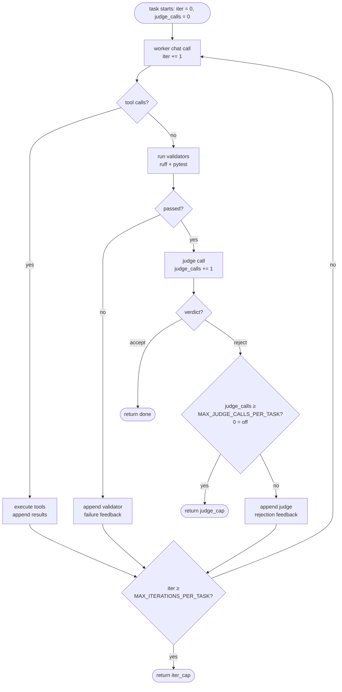

# The two loops (Ralph vs. tool-use)

There are two loops in the harness, and the names matter because they govern different things.

## Outer loop — `run()` in `loop.py`

The Ralph loop proper. Picks the next pending task from `prd.json`, runs it to completion, resets context, picks the next one.

Bounded by:

- `TILTH_MAX_WALL_CLOCK_MINUTES`
- `TILTH_MAX_TOKENS`
- "no more pending tasks"

This loop has no iteration cap. If you have 20 tasks and the wall-clock and token caps allow it, it'll run all 20.

## Inner loop — `_run_task()` in `loop.py`

The tool-use / ReAct loop *inside* a single task. Bounded by `TILTH_MAX_ITERATIONS_PER_TASK`. **This is what the env var caps.**

```python
for iter_n in range(client.config.max_iterations_per_task):
    resp = client.chat(messages, tools=tool_schemas)
    ...
```

So: "Ralph loop = outer, tool-use loop = inner, the iterations env var caps the inner."

> **Diagram suggestion** — *two nested boxes: an outer "Ralph loop" labelled with `MAX_WALL_CLOCK_MINUTES` and `MAX_TOKENS`, containing an inner "tool-use loop" labelled with `MAX_ITERATIONS_PER_TASK`. Arrows on the outer loop iterate over tasks; arrows on the inner iterate over model calls within one task. Annotate where each cap fires.*

## What one inner iteration actually is

Each iteration is **exactly one worker `client.chat()` call**, plus whatever the harness does in response. Three branches per iteration:

1. **Model emits tool calls.** Harness executes them (with `pre_tool` hook gating, `post_edit` follow-up), appends results as tool messages, `continue` to next iteration.
2. **Model emits no tool calls (claims done).** Harness runs validators (`ruff`, `pytest`). pytest is **filtered to the current task's tests plus every previously-completed task's tests**, by filename convention (`tests/test_<task-id-lower>_*.py`). Tests for still-`pending` tasks are excluded — so a future task's failing tests can't masquerade as the current task's failure and pull the worker into building out-of-scope code — but tests from `done` tasks stay in scope, so a regression there fails the current task and gets fed back to the worker.
    - Validators pass → judge call. Judge accepts → `return "done"`. Judge rejects → append rejection as a user message, fall through to next iteration.
    - Validators fail → append failure report as a user message, fall through to next iteration.
3. **Loop falls off the end** — N iterations consumed, model still hasn't both declared done *and* satisfied validators+judge → `return "iter_cap"`. Task gets marked `failed` in `prd.json`, the run halts.

## What does and doesn't count as an iteration

| Action | Counts as an iteration? |
|---|---|
| Worker model call (any of the three branches above) | **Yes** — one per iteration |
| Tool execution (bash, file ops, etc.) | No — runs as part of an iteration |
| Validator runs (ruff, pytest) | No |
| Judge model call | **No** — separate call, not an iteration |
| `_self_improve` AGENTS.md update call | **No** — happens once after the inner loop returns "done" |
| Validator failure feedback round | Yes — the next worker call to fix it is iteration N+1 |
| Judge rejection feedback round | Yes — same reason |

## A subtlety: judge rejections eat iterations

This is worth flagging because it's not obvious. With `MAX_ITERATIONS_PER_TASK=8`:

- Worker spends 5 iterations writing code, declares done.
- Validators pass, judge rejects.
- Worker has 3 iterations left to address the rejection, declare done again, get re-judged.
- If the judge rejects again, worker has fewer iterations to recover.

**A stricter judge effectively shrinks the working iteration budget.** The judge prompt's instruction to "name a specific concern, vague rejections waste worker iterations" exists for this exact reason — every judge rejection costs the worker forward progress on the same fixed budget.

There is also an *optional* second cap that bounds the same failure mode from the judge side: `MAX_JUDGE_CALLS_PER_TASK`. Set to `0` (the default), it does nothing. Set to N, the task is marked `failed` after the Nth judge rejection on this task — the run halts with reason `judge_cap`. The cap exists for the worker↔judge ping-pong case where the iteration budget would otherwise let the worker keep retrying right up until `iter_cap`, burning tokens on a task the judge is never going to accept. Pick a number you're willing to spend per stuck task; leave unset if you'd rather let `MAX_ITERATIONS_PER_TASK` and `MAX_TOKENS` be the only ceilings.

## Inner-loop flow



> **Diagram suggestion** — *the mermaid block above renders directly on GitHub and on mkdocs themes that ship Mermaid (e.g. mkdocs-material with `pymdownx.superfences`). With the vanilla `mkdocs` theme it falls back to a code block. If we ever publish a static SVG of this flowchart, swap it in here as the canonical version.*

Two halt-with-failure exits (`iter_cap`, `judge_cap`), one halt-with-success exit (`done`). Both failure exits mark the task `failed`, log a `task_failed` event with the matching `reason`, and stop the Ralph loop — `--resume` flips them back to pending and unwinds the FAILED placeholder commit, so neither is destructive.

## Worst-case tokens per task

```
worker_tokens × MAX_ITERATIONS_PER_TASK   (8 by default)
+ judge_tokens × number_of_judge_calls     (1 per "I'm done" attempt;
                                             capped by MAX_JUDGE_CALLS_PER_TASK
                                             if set, otherwise unbounded
                                             within the iteration budget)
+ self_improve_tokens                      (1 if task succeeds, 0 otherwise)
```

The judge is called once per "I'm done" attempt that passes validators. With `MAX_JUDGE_CALLS_PER_TASK=0` (default) there is no separate cap; the iteration budget is the only ceiling. With it set, that's the tighter of the two bounds on judge spend.

## Mental model

- **`MAX_WALL_CLOCK_MINUTES`** and **`MAX_TOKENS`** stop the Ralph loop.
- **`MAX_ITERATIONS_PER_TASK`** stops a task that's spinning. Bounds worker effort *within* a task. Caps tokens per task *indirectly* (no direct per-task token cap exists).
- **`MAX_JUDGE_CALLS_PER_TASK`** (optional, off by default) stops a task that's worker↔judge ping-ponging. Bounds judge spend on a single PRD item.

Default `MAX_ITERATIONS_PER_TASK=8` means: each task gets at most 8 worker turns to explore → edit → run tests → fix lint → respond to judge → finally declare done with everything green. For tightly-scoped tasks with upfront tests, that's usually 3–5 in practice. Bumping to 12 or 16 gives the agent more room on harder tasks; lowering to 4 forces tighter PRDs.
