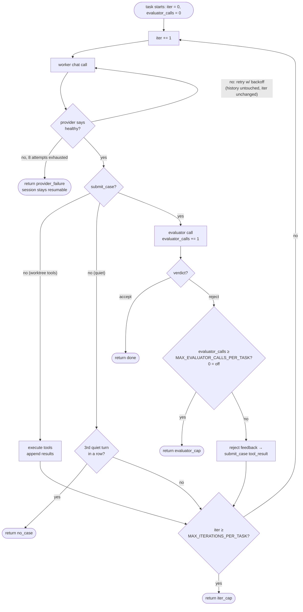

# The two loops (Ralph vs. tool-use)

There are two loops in the harness, and the names matter because they govern different things.

## Outer loop — `run()` in `loop.py`

The Ralph loop proper. Picks the next pending task (the authored task list from `.tilth/tasks/`, with status overlaid from the harness-owned `task-status.json`), runs it to completion, resets context, picks the next one.

Bounded by:

- `TILTH_MAX_WALL_CLOCK_MINUTES`
- `TILTH_MAX_TOKENS`
- "no more pending tasks"

This loop has no iteration cap. If you have 20 tasks and the wall-clock and token caps allow it, it'll run all 20.

## Inner loop — `_run_task()` in `loop.py`

The tool-use / ReAct loop *inside* a single task. Bounded by `TILTH_MAX_ITERATIONS_PER_TASK`. **This is what the env var caps.**

```python
for iter_n in range(client.config.max_iterations_per_task):
    resp = _chat_healthy(client, session, messages, tools=tool_schemas, ...)
    ...
```

So: "Ralph loop = outer, tool-use loop = inner, the iterations env var caps the inner." (`_chat_healthy` is the provider-health gate — every model call routes through it; see [below](#what-one-inner-iteration-actually-is).)

## What one inner iteration actually is

Each iteration is **exactly one worker `client.chat()` call**, plus whatever the harness does in response. The branches per iteration:

1. **Model calls worktree tools** (`bash`, `read_file`, `edit_file`, …). Harness executes them (with `pre_tool` hook gating), appends results as tool messages, `continue` to next iteration.
2. **Model calls `submit_case`** (its done-signal — see [The worker↔evaluator dialogue](worker-evaluator-dialogue.md)). The worker presents a structured case (summary + AC→`file:symbol` mapping + work-arounds + uncertainties). The harness hands the case + diff straight to the evaluator — there is no codified validator step; **the evaluator is the only gate**. Evaluator accepts → `return "done"`. Evaluator rejects → the structured reject is returned as the `submit_case` tool_result, fall through to next iteration.
3. **Model goes quiet without a case** — no tool calls and no `submit_case`. Not "done": the harness nudges it to submit one (each nudge logged as a `nudge` event), and after `MAX_CONSECUTIVE_NO_CASE_NUDGES` (3) quiet turns in a row gives up → `return "no_case"`.
4. **Loop falls off the end** — N iterations consumed, the worker still hasn't submitted a case the evaluator accepts → `return "iter_cap"`. The task is marked `failed` (in `task-status.json`), the run halts.

There's a step *before* the branches: every chat call (worker and evaluator) routes through a provider-health gate (`loop._chat_healthy`). A response the provider itself marks unhealthy — an `error` object, `finish_reason: "error"`, or a completely empty body — **never becomes a conversation turn**. It's retried with the message history untouched (exponential backoff, `PROVIDER_RETRY_MAX_ATTEMPTS` (8) attempts ≈ 3 minutes of patience), doesn't consume an iteration, and is never mistaken for the worker going quiet. If the budget is exhausted → `return "provider_failure"` — the task is marked `failed` but the session status stays `running`, so `tilth resume` retries it. Health is judged by the provider's signals, not by what the message happens to contain: a partial errored generation can still carry a truncated reasoning trace, and echoing that back as history is exactly the poisoning this gate exists to prevent.

## What does and doesn't count as an iteration

| Action | Counts as an iteration? |
|---|---|
| Worker model call (any of the branches above) | **Yes** — one per iteration |
| Provider-health retry (unhealthy response) | No — retried inside the same iteration; provider noise doesn't drain the budget |
| Tool execution (bash, file ops, etc.) | No — runs as part of an iteration |
| Evaluator model call | **No** — separate call, not an iteration |
| Evaluator rejection feedback round | Yes — the next worker call to address it is iteration N+1 |

## A subtlety: evaluator rejections eat iterations

This is worth flagging because it's not obvious. Under `MAX_ITERATIONS_PER_TASK` (32 by default):

- Worker spends several iterations writing code, then submits a case.
- The evaluator rejects.
- Worker now has to address the rejection, submit again, and get re-evaluated — all out of the *same* fixed budget.
- If the evaluator rejects again, the worker has fewer iterations left to recover; a string of rejections can run a task into the cap.

**A stricter evaluator effectively shrinks the working iteration budget.** The evaluator prompt's instruction that "vague rejections waste worker iterations" exists for this exact reason — every reject costs the worker forward progress on the same fixed budget.

The evaluator isn't amnesiac within a task: each call reads the last few entries of a per-task ledger (`sessions/<id>/ledger/<task_id>.jsonl`) — its own prior verdicts on this task — so it can confirm a concern was resolved instead of re-litigating, and escalate when the same rejection category recurs. The worker sees the same ledger (its reviewer's prior verdicts) on later iterations. See [The worker↔evaluator dialogue](worker-evaluator-dialogue.md) for the full mechanism.

There is also an *optional* second cap that bounds the same failure mode from the evaluator side: `MAX_EVALUATOR_CALLS_PER_TASK`. Set to `0` (the default), it does nothing. Set to N, the task is marked `failed` after the Nth evaluator rejection on this task — the run halts with reason `evaluator_cap`. The cap exists for the worker↔evaluator ping-pong case where the iteration budget would otherwise let the worker keep retrying right up until `iter_cap`, burning tokens on a task the evaluator is never going to accept. Pick a number you're willing to spend per stuck task; leave unset if you'd rather let `MAX_ITERATIONS_PER_TASK` and `MAX_TOKENS` be the only ceilings.

## Inner-loop flow



The verdict is a structured `submit_verdict` tool call — `accept`/`reject` plus, on reject, a `rejection_category` (one of six), a concern, evidence pointers, and a concrete `next_step` that becomes the worker-visible reject feedback. See [The worker↔evaluator dialogue](worker-evaluator-dialogue.md). (A `submit_case` that can't be parsed doesn't reach the evaluator at all — the parse error goes back as the tool_result and the worker retries; it costs an iteration but not an evaluator call.)

Four halt-with-failure exits (`iter_cap`, `evaluator_cap`, `provider_failure`, `no_case`), one halt-with-success exit (`done`). All failure exits mark the task `failed`, log a `task_failed` event with the matching `reason`, and stop the Ralph loop — `tilth resume` flips them back to pending and unwinds the FAILED placeholder commit, so none is destructive. They differ in what they say about the session: `iter_cap` / `evaluator_cap` / `no_case` mark the session status `failed` (the *work* got stuck), while `provider_failure` leaves it `running` (the *endpoint* had a bad window — nothing about the work is wrong, resume and retry).

## Worst-case tokens per task

```
worker_tokens × MAX_ITERATIONS_PER_TASK       (32 by default)
+ evaluator_tokens × number_of_evaluator_calls (1–2 calls per submitted case —
                                                a parse-retry doubles a call;
                                                capped by
                                                MAX_EVALUATOR_CALLS_PER_TASK if set,
                                                otherwise unbounded within the
                                                iteration budget)
```

The evaluator is called once per parseable `submit_case` (with one internal retry if its own `submit_verdict` doesn't parse). With `MAX_EVALUATOR_CALLS_PER_TASK=0` (default) there is no separate cap; the iteration budget is the only ceiling. With it set, that's the tighter of the two bounds on evaluator spend.

## What can stop a run

The caps exist because Tilth runs unattended. An interactive agent doesn't need a hard ceiling — a human watching the scrollback notices a runaway and stops it. Tilth has no such human for the length of a run, so the caps *are* that human: a budget the harness enforces on its behalf. They're set deliberately loose (a stuck task should be the exception), and a hit is always loud and resumable, never silent.

Two operate at the **session level**, stopping the Ralph loop between tasks:

- **`MAX_WALL_CLOCK_MINUTES`** and **`MAX_TOKENS`** — checked at the top of each task, so the current task finishes first. Where the token cap is read and why enforcement is between-task is in [Token recording](token-recording.md).

The rest operate at the **task level** — they mark the task `failed`, log `task_failed`, and halt the run; the next `tilth resume` retries with a fresh budget, so none is destructive:

- **`MAX_ITERATIONS_PER_TASK`** — the task spun out its iteration budget (the `iter_cap` exit above). Bounds worker effort within a task, and caps per-task tokens *indirectly* — there is no direct per-task token cap.
- **`MAX_EVALUATOR_CALLS_PER_TASK`** *(optional; `0` = off, the default)* — stops a worker↔evaluator ping-pong before it burns the whole iteration budget on a task the evaluator won't accept.
- **`provider_failure`** and **`no_case`** — the two fixed backstops from the flowchart (a misbehaving endpoint; a worker that never presents its case). Not env-tunable.

There's no per-call cap. `provider_failure` is the one task-level stop that leaves the *session* status `running` — the endpoint had a bad window, nothing about the work is wrong — so it's resumable like a session-level cap.

Default `MAX_ITERATIONS_PER_TASK=32` means each task gets at most 32 worker turns to explore → edit → verify → answer the evaluator → submit an accepted case. For tightly-scoped tasks with sharp acceptance criteria, that's usually 3–5 in practice. Bumping it gives harder tasks more room; lowering it forces tighter task files.

### What hitting a cap looks like

An `iter_cap` hit, with the post-run summary the harness prints on the way out:

![Terminal capture: task T-003 reaches iter 8, the harness logs "task T-003 hit iteration cap [TILTH_MAX_ITERATIONS_PER_TASK=8]" and then "× T-003 failed (iter_cap); halting run". A run summary block follows: session 20260523-082151-45f0a5, branch session/20260523-082151-45f0a5, duration 2m27s (2.0% of TILTH_MAX_WALL_CLOCK_MINUTES=120), tokens 75,387 (3.8% of TILTH_MAX_TOKENS=2,000,000), tasks done=2 failed=1 pending=2.](../assets/iter-cap-and-summary.png)

*The cap fires and the run halts mid-task list (T-003 of five). The summary surfaces every cap as a percentage, so it's obvious which one bit — duration and tokens are both well under, only iterations were tight. (This capture predates the default bump — the cap was `8` here, below today's `32` — which is why it halts this early.)*
{: .caption }

The `failed=1 pending=2` line is what `tilth resume` reads to plan its retry — see [Resuming & resetting](../getting-started/resuming-and-resetting.md) for what picks up from this exact point (same session id).
