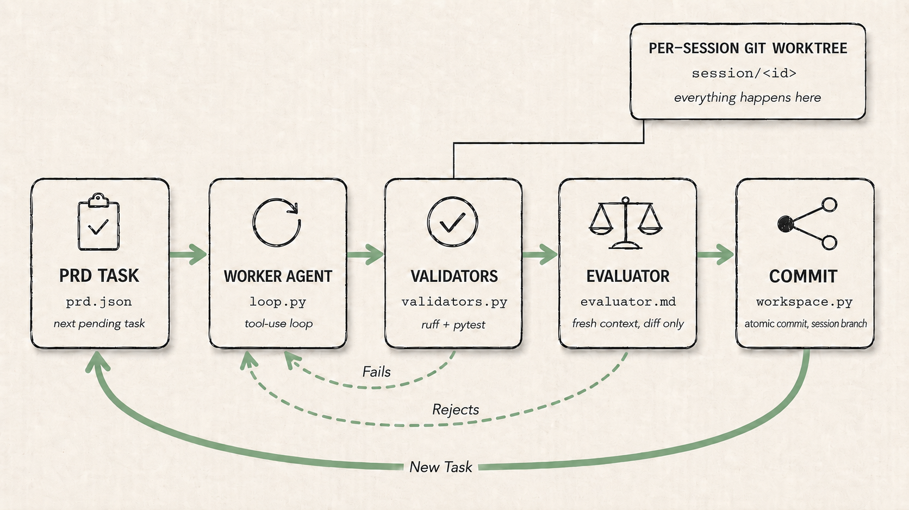

# Tilth

> *Prepare the ground, let the agent grow the work.*

A minimal long-running agent harness against any **OpenAI-compatible** LLM endpoint — Ollama Cloud, OpenRouter, Together, Groq, Anyscale, Fireworks, vLLM, LM Studio. At this point it should be noted I only activly test on OpenRouter. Built to learn (and demonstrate) the Brain/Hands/Session split, the Ralph loop, and the four memory channels described in Addy Osmani's [long-running agents](https://addyosmani.com/blog/long-running-agents/), [agent harness engineering](https://addyosmani.com/blog/agent-harness-engineering/), and [self-improving agents](https://addyosmani.com/blog/self-improving-agents/) posts.


*Brain / Hands / Session*
{: .caption }

**Audience:** This is an active research project for my work in [Altered Craft](https://alteredcraft.com). I do activly use it for real work, so I would advise it for single-dev / few-dev teams who want to *understand* what a long-running agent harness actually does. That is today (May-2026), in the future, we shall see.

**Target run:** I test with 10-60 minutes of autonomous work against an open model (default `deepseek/deepseek-v4-pro` on OpenRouter). Completing a task list against a small project on a per-session git worktree.



*Tilth's Ralph loop*
{: .caption }

## What's in these docs

- **[Getting started](getting-started/installation.md)** — install, run the demo, resume / reset / visualize a session.
- **[Architecture](architecture/overview.md)** — the Brain / Hands / Session split, the four memory channels.
- **[Deep dives](deep-dives/index.md)** — the two loops, token recording and enforcement, what the agent sees (and doesn't), the caps story, resume / reset mechanics.
- **[Reference](reference/safety-guards.md)** — safety guards.

## Architecture at a glance

Three independently-replaceable components:

- **Brain** — `tilth/client.py`. The LLM-reasoning role, instantiated as a **Worker** (tool-use loop, full history, Hands access) and a **Judge** (one-shot per task, fresh context, no tools). The two can sit on different providers and/or models.
- **Hands** — `tilth/workspace.py` (per-session git worktree) + `tilth/tools/` (allow-listed bash, file ops, search) + `tilth/hooks/` (pre-tool veto, post-edit lint). Belongs to the Worker today.
- **Session** — `tilth/session.py`. Append-only `events.jsonl` + checkpoint, enough to `wake(session_id)` on a fresh process. A `summary.json` is rebuilt at every task boundary (`tilth/summary.py`) as a denormalised view for the visualizer and any external consumers.

Four memory channels live outside the agent:

- `AGENTS.md` — the agent's own learned conventions and gotchas (in the *workspace*).
- Git history — atomic commits per task (in the *worktree*).
- `progress.txt` — chronological journal of task attempts (in the *workspace*).
- `prd.json` — task list with status flags (in the *workspace*).

Generator/evaluator separation: the **Judge** Brain (`tilth/prompts/judge.md`) sees only the diff + acceptance criteria — none of the worker's history. That independence is what makes it useful.

See [Architecture overview](architecture/overview.md) for the longer story.

## A first pass at running it

```bash
git clone git@github.com:AlteredCraft/tilth.git {{your projects folder}}/tilth
cd {{your projects folder}}/tilth
uv venv
uv sync
cp .env.example .env
# edit .env, set TILTH_BASE_URL, TILTH_API_KEY, and TILTH_WORKER_MODEL
```

Then run the demo:

```bash
git clone git@github.com:AlteredCraft/tilth-demo-todo-cli.git {{your projects folder}}/tilth-demo
uv run tilth {{your projects folder}}/tilth-demo
```

Full setup notes live in [Installation](getting-started/installation.md); the demo walkthrough is in [Running the demo](getting-started/running-the-demo.md).

## Going deeper

The [Deep dives](deep-dives/index.md) section is honest, code-level walk-throughs of the mechanics that aren't load-bearing for *using* the harness, but matter when you want to extend, debug, or reason about the safety story. Useful if you're extending or debugging the harness rather than just running it.
