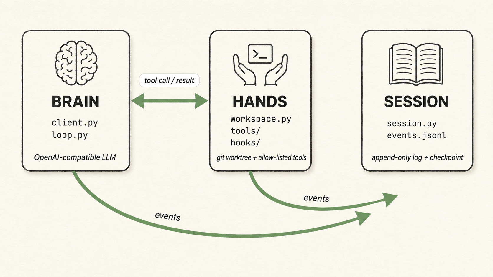
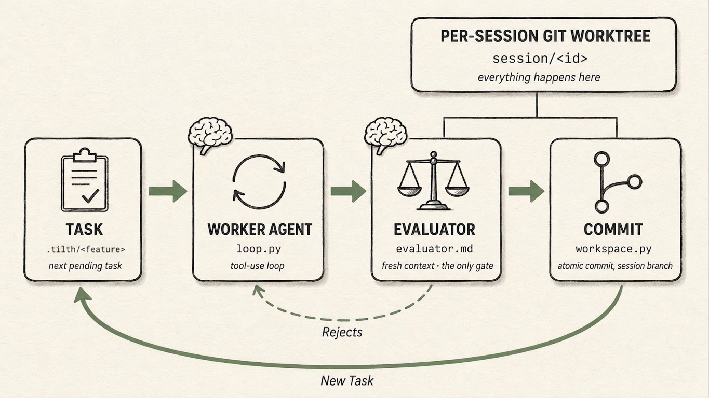

# Tilth

> *Prepare the ground, let the agent grow the work.*

A minimal long-running agent harness against an **OpenAI-compatible** LLM endpoint. Tested today against [OpenRouter](https://openrouter.ai); the OpenAI SDK underneath means other OpenAI-flavour gateways should work, but support for them is on the roadmap rather than validated. Built to learn (and demonstrate) the Brain/Hands/Session split, the Ralph loop, and the file-backed memory channels described in Addy Osmani's [long-running agents](https://addyosmani.com/blog/long-running-agents/) and [agent harness engineering](https://addyosmani.com/blog/agent-harness-engineering/) posts.

*Brain / Hands / Session*
{: .caption }

**Audience:** This is an active research project for my work in [Altered Craft](https://alteredcraft.com). I do actively use it for real work, so I would advise it for single-dev / few-dev teams who want to *understand* what a long-running agent harness actually does. That is today (June-2026), in the future, we shall see.

**Target run:** I test with 10-60 minutes of autonomous work against an open model (default `deepseek/deepseek-v4-flash` on OpenRouter for the worker; the evaluator defaults to `deepseek/deepseek-v4-pro`). Completing a short task list against a small project on a per-session git worktree.

> **Status — prompt-driven core.** Tilth is deliberately small and currently being driven *down* to its essentials: a worker and an independent evaluator, the base file/search/bash tools, and full observability. There is **no codified test/lint gate** — the evaluator is the only gate — and **no interview step**: you author the work as markdown under `<repo>/.tilth/tasks/` and run it. Capabilities get added back only as testing shows they're needed.

*The harness loop*
{: .caption }

## What is a harness?

A **harness** is the deterministic code wrapped around the model — it decides what the model sees, when it runs, and what happens to what it produces. The model is the *brain*; the harness is everything around it that turns a single model call into a loop that finishes work.

The labels under each box in the diagram above are that harness, made literal: `loop.py` and `workspace.py` are Tilth's code; `.tilth/tasks/` is the work you authored; `evaluator.md` is the prompt it hands to a second model. The harness owns the **arrows** — the forward path, the dashed `Rejects` feedback, and the green `New Task` loop. It picks the next task, routes the evaluator's verdict, commits to the session branch, and moves on. That green `New Task` arrow is the Ralph loop proper — the outer loop that carries a session from one task to the next.

The model owns only what happens *inside* a box:

- the **worker agent's** tool use — which tools to call, and when to `submit_case`;
- the **evaluator's** verdict — `accept` or `reject` (the model decides it; the harness routes it onto an arrow).

That boundary is the point of an autonomous harness: the agent acts within a step, the harness orchestrates the steps, and the agent never steers the loop or sees the machinery driving it. For the code-level version — the two nested loops, the caps, and what the agent can and can't see — see [The two loops](deep-dives/two-loops.md) and [Agent visibility](architecture/agent-visibility.md).

## How Tilth differs from other harnesses

Tilth is informed by the minimal-harness lineage — small system prompt, a handful of tools, state in files — but it makes one different bet: it runs **autonomously**. Many minimal coding agents are *interactive*: a developer watches the scrollback and course-corrects, kills a bad run, or re-prompts mid-task. Tilth removes that human for the length of a run (10–60 min).

Almost everything distinctive about Tilth follows from that one difference. Each piece stands in for a call a watching human would otherwise make:

- **The [evaluator](deep-dives/worker-evaluator-dialogue.md)** — a second model that judges whether a change is a *proper* solution against the task's acceptance criteria, not just whether the code runs. There is no codified test/lint gate in front of it; the evaluator is the reviewer who isn't in the room, and the only gate.
- **[Between-task caps](deep-dives/two-loops.md#what-can-stop-a-run)** — the budget ceiling (iterations, tokens, wall-clock) a human would otherwise impose by noticing a runaway and stopping it.
- **[State kept out of the model](architecture/agent-visibility.md)** — the mutable status machinery is hidden, so an unattended agent can't mark its own work done, skip ahead, or rewrite the queue.
- **[Hyper-observability](deep-dives/hyper-observability.md)** — when no one is watching mid-run, the recording *is* the supervision. Every prompt the harness sends is recorded and every run replays end-to-end from its `events.jsonl` (`tilth visualize`). Offline-first by design: a finished run you inspect, not a live TUI to babysit.

None of this is a knock on interactive agents; it's a different shape for a different job.

*Every run — streaming live or replayed after the fact — is browsable as a chat-style web app with [`tilth visualize`](getting-started/visualizing.md). When no one is watching mid-run, the recording **is** the supervision.*
{: .caption }

## What's in these docs

- **[Getting started](getting-started/installation.md)** — install, author a task list under `.tilth/tasks/`, run the demo, [visualize](getting-started/visualizing.md) / resume / reset a session.
- **[Architecture](architecture/overview.md)** — the Brain / Hands / Session split, the memory channels, and what the agent sees (and doesn't).
- **[Deep dives](deep-dives/index.md)** — [hyper-observability](deep-dives/hyper-observability.md) and `tilth visualize`, the two loops and what can stop a run, the worker↔evaluator dialogue, token recording, the task format, session layout. Honest, code-level walk-throughs for extending, debugging, or reasoning about the safety story.
- **[Reference](reference/safety-guards.md)** — safety guards.
